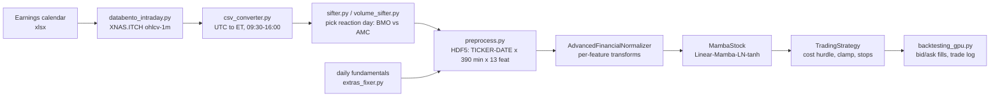

# Mamba State-Space Models for Post-Earnings Intraday Trading

An early (2025) research project: I extended the MambaStock selective state-space model to forecast
20-minute returns on 1-minute bars on earnings-reaction days, and built the cost-aware backtester
around it. The backtests showed the forecasts were not usable, and working out why is the main
result of the project.

> **Derived work.** This repository started as a copy of
> [zshicode/MambaStock](https://github.com/zshicode/MambaStock) (Shi, 2024,
> [arXiv:2402.18959](https://arxiv.org/abs/2402.18959)). The Mamba implementation in
> `src/mamba.py` and `src/pscan.py` comes from
> [alxndrTL/mamba.py](https://github.com/alxndrTL/mamba.py) through MambaStock, and `src/main.py` is
> MambaStock's script with a one-line change. Everything else (data tooling, HDF5 datasets,
> normalization, trainer, strategies, backtesters, diagnostics) is my addition. The upstream git
> history is preserved. See [License](#license).

## Key results

The findings below come from my backtest logs and my code review at the time. The logs themselves
are not committed, so the few specific numbers quoted are the ones the backtest printed; everything
else is either visible in the code or stated qualitatively.

- **The first design gave impossible forecasts.** It predicted one minute at a time and chained 20
  steps together, so small per-step errors compounded. The backtest printed 20-minute forecasts of
  +20% and more (AGNC: +44.25%).
- **The uncertainty layer did nothing.** Every prediction came out with `p_netpos` = 1.000 and
  entropy = 0.000. As a result, none of the confidence-based entry and exit rules ever triggered,
  and the strategy reduced to "always go long and hold 20 minutes".
- **The edge was about the same size as the costs.** In the code, the entry threshold (+0.10%
  forecast) equals the round-trip cost (5 bps half-spread per side). One run took 52 trades in a
  short window, and the model almost never forecast a down move.
- **Fixing one problem exposed the next.** In v2 the target became a single 20-minute log return,
  the output was bounded with `tanh`, and a volatility-scaled clamp was added. That removed the
  explosions. The next problem recorded in the code is the opposite one: forecasts shrinking
  toward zero. I built a learning-dynamics diagnostic for it and changed the return-scaling
  constant (details below).
- **Outcome:** no configuration produced a validated, cost-positive backtest. My conclusion was that
  a sequence model on 1-minute OHLCV bars does not carry enough information to beat about 10 bps of
  round-trip cost. That is why my later work moved to order-book data:
  [hidden-liquidity-microstructure](https://github.com/Darson2004/hidden-liquidity-microstructure).

## Why this problem

On the day after an earnings release, prices keep adjusting as new information comes in. That makes
the day a natural test of whether a sequence model can forecast intraday drift. I focused on the
quiet 11:00–13:00 ET window, after the open, and traded only when the forecast return cleared
round-trip costs. The original plan was to trade both long and short ([`docs/product.md`](docs/product.md)).
The backtesters as committed are long-only; the short paths are commented out.

## Method



**Data.** Each training sample is one stock on one earnings-reaction day: 390 one-minute bars with
13 features: OHLC, volume, P/E, turnover, total and float shares, minute of day, % change from the
open, and two missing-value masks. Earnings days are labelled before-open or after-close by checking
which of the two downloaded days has the larger post-10:00 range or volume.

**Model** (`src/mambastock_model.py`). Linear 13→64, dropout 0.3, one Mamba block (d_model 64),
LayerNorm, dropout, last token, Linear 64→1, then `tanh`. The v2 target is the 20-minute log return
of the close:

$$y_t = \log P_{t+20} - \log P_t$$

Training (`src/train_two_gpu.py`) walks forward through the trading day on a growing window (the
model sees the last 90 minutes). It uses MSE loss, AdamW (lr 1e-4, wd 1e-4), gradient clipping at
0.5, 4-step gradient accumulation, AMP on CUDA, and 0.01 Gaussian input noise.

**Normalization** (`src/advanced_normalization.py`). Each feature gets its own transform. Prices are
taken as log values relative to the first close in the window, then z-scored within the window.
Volume is divided by its minute-of-day median, then `log1p`, then z-scored. Returns are `log1p`,
soft-clipped with $G\tanh(r/G)$, then z-scored. P/E is winsorized, `log1p`, then robust-scaled
across stocks. Turnover gets a logit or a de-seasonalized transform depending on its scale. Share
counts get `log1p` plus cross-sectional scaling. Minute of day is mapped to [0, 1], and the masks
pass through unchanged.

**Strategy** (`src/strategy.py`, run by `src/backtesting_gpu.py`). Each minute the model makes a
fresh forecast $\mu_{20}$ from the observed window. Past forecasts are never fed back in. The
forecast is then bounded by recent volatility:

$$\hat\sigma_{1m} = 1.4826\,\mathrm{MAD}(r_{t-60:t}),\qquad \mu_{20} \leftarrow \mathrm{clip}\big(\mu_{20},\ \pm k\,\hat\sigma_{1m}\sqrt{20}\big),\ k=2$$

A position is opened only if $\mu_{20} \ge \max(\theta,\ h)$, with
$h = 2(\text{half-spread} + \text{commission} + \text{slippage}) + \text{buffer}$. Candidates are
ranked by $\mu_{20} - h$, and the backtester applies a top-k limit, a 1% cap per name and a 2% cap
on capital added per minute. Buys fill at the ask and sells at the bid (mid ± half-spread). Each
position closes on a −0.50% stop, at 20 minutes, or at end of day. Forecasts are logged from
`PREDICT_START`, orders are allowed only inside `[TRADE_START, TRADE_END)`, and no entry is taken
after `TRADE_END − 20`.

## Results

| Version | Forecast design | What the backtest showed |
|---|---|---|
| v1 | 1-minute steps chained over 20 steps; MC-dropout `mu20`/`sigma20`, `p_netpos`, entropy gates | 20-minute forecasts of +20% and more (up to +44.25%); `p_netpos` = 1.000 and entropy = 0.000 on every forecast; 52 trades in a short window; almost no down forecasts; most exits at the 20-minute limit |
| Simple threshold rules (`src/bare_strategy.py`) | Buy if forecast ≥ +0.10%; exit on −0.50% or after 20 minutes | Entry threshold equal to round-trip cost, so trades at best broke even after costs |
| v2 (`src/strategy.py`) | Direct 20-minute log-return target, `tanh`-bounded; fresh forecast each minute; volatility clamp; cost hurdle; bid/ask fills | Explosive forecasts gone; next issue recorded in the code (`src/learning_dynamics_analyzer.py`) is forecast shrinkage toward zero; no cost-positive configuration recorded |

`docs/product.md` also records the model's feature-importance ranking, most to least important: open,
low, float_share, close, pct_chg, high, volume, pe_nan_mask, pe, turnover_rate_mask, turnover_rate,
total_share.

## Validation and pitfalls caught

| Problem | How it showed up | Fix in the code |
|---|---|---|
| Errors compounding across chained steps | Forecasts of +44% over 20 minutes | Predict the 20-minute return directly; never feed forecasts back in (`src/strategy.py`) |
| Overconfident uncertainty | `p_netpos` stuck at 1, entropy at 0, so the confidence gates never fired | Removed from v2. Lesson: check that the gates actually vary before trusting them |
| Edge not covering costs | 0.10% threshold equal to 0.10% round-trip cost | Explicit hurdle `h`; entries ranked by `mu20 − h` |
| Exits sold dollars, not shares | Positions could be left partly open | Sells work in shares and always close the full position |
| Unbounded outliers driving position size | Extreme `mu20` | `tanh` output plus volatility clamp using MAD |
| Forecasts squashed toward zero | Shrinkage after bounding | Return scale `G` changed from 2σ to the 99.5th percentile; `learning_dynamics_analyzer.py` compares train and validation loss curves |
| Future data in the normalizer | Minute-of-day volume medians computed from all minutes, including later ones | Medians now use only the first 80% of minutes (`create_advanced_normalizer(use_historical_only=True)`) |
| Unrepeatable runs | Results depended on RNG and date ordering | `seed_everything` in the backtester; deterministic cuDNN |
| Spread accounting | Spread cost not separated per fill, so it could be double-counted | Buys at the ask, sells at the bid; `spread_paid` recorded per fill, so realized P&L plus spread paid equals mid-price P&L |

Remaining weak points:

- The train/validation split and the "historical-only" statistics split each day by **minute**, not
  by **date**. A true out-of-sample test needs date-disjoint HDF5 files (`data_tools/split_hdf5.py
  --mode time`). The repo does not record whether the backtest files were built that way.
- The trainer loads at most 200 stock-days per file (`max_stocks` in `src/dataset.py`), so the
  sample is small.
- No backtest logs, trade logs or model weights are committed, so none of the results above can be
  re-checked from this repo alone.

## Repo layout

```
src/
  mamba.py, pscan.py           Mamba block + parallel scan (from alxndrTL/mamba.py via MambaStock)
  main.py                      upstream MambaStock script, adapted to one day of minute bars
  mambastock_model.py          model: Linear -> Mamba -> LayerNorm -> Linear -> tanh
  dataset.py                   HDF5 dataset (lazy or GPU-resident), time-aligned batch sampler
  mambastock_hdf5_dataset.py,  earlier dataset variants (used by eval_mambastock.py)
  ohlcv_dataset.py
  advanced_normalization.py    per-feature normalizer (log-relative prices, de-seasonalized volume, ...)
  train_two_gpu.py             v2 trainer (growing window, AMP, gradient accumulation)
  strategy.py                  v2 strategy: cost hurdle, volatility clamp, stops, caps, trade log
  bare_strategy.py             simple threshold strategy (used by backtesting.py)
  strategy_normalized.py       earlier batch strategy with MC-dropout confidence
  backtesting.py               per-day backtest with plots and prediction CSVs (bare_strategy)
  backtesting_gpu.py           CLI backtester for strategy.py (costs, caps, seed)
  learning_dynamics_analyzer.py  train vs validation loss curves (underfit / overfit / shrinkage)
  weight_comparison.py, comparison_gpu.py  compare two checkpoints on the same test file
  eval_mambastock.py, analyze_results.py, plot_loss.py  evaluation and plotting helpers
data_tools/                    Databento/Bloomberg fetchers, UTC->ET, BMO/AMC labelling, HDF5 build/split/merge
tests/                         smoke-test scripts (see below)
docs/
  product.md                   original project goal
  cpu_and_memory.md            CPU fallback and GPU memory settings
data/README.md                 how to obtain and build the data (none is committed)
```

## Reproducing

```bash
git clone https://github.com/Darson2004/mamba-earnings-intraday.git
cd mamba-earnings-intraday
pip install -r requirements.txt          # Python 3.9+; see docs/cpu_and_memory.md for CPU-only torch

# 1. Build data (see data/README.md): Databento key in DATABENTO_API_KEY
python data_tools/databento_intraday.py  # EARNINGS_XLSX=path/to/earnings_equity_first.xlsx
python data_tools/csv_converter.py
python data_tools/preprocess.py --input_file minute_bars.csv --output_file training_data.h5

# 2. Train (reads training_data.h5 in the working directory, writes mambastock.pth, log_two.txt)
python src/train_two_gpu.py

# 3. Backtest on a separate, date-disjoint file
python src/backtesting_gpu.py --h5 test_data.h5 --model mambastock.pth \
    --trade_start 90 --trade_end 210 --spread_bps 5 --top_k 3 --seed 1337

# 4. Diagnostics
python src/learning_dynamics_analyzer.py
```

**Data licensing.** Databento and Bloomberg data are licensed and not redistributed here. The
upstream TuShare sample CSVs were also removed. Everything under `data/`, and all `*.csv`, `*.h5`
and `*.pth` files, are git-ignored.

**Tests.** The files in `tests/` are script-style smoke checks (`python tests/<file>.py`), not a
unit-test suite. `test_stagnation_sell.py` and `test_strategy_random.py` run on synthetic data. The
memory and CPU checks need a processed HDF5 file. `test_timestep_categorization.py` was written
against an earlier `TradingStrategy` API (`snr_threshold`, `n_mc_samples`) and fails against the
current `strategy.py`.

## Limitations and next steps

- 1-minute OHLCV bars plus daily fundamentals carry little information at a 20-minute horizon. The
  obvious next input is order-flow and order-book state, which is where my later work went.
- Evaluate against simple baselines (zero forecast, momentum since the open) on date-disjoint
  folds, using rank IC and hit rate as well as P&L, before adding strategy logic.
- Calibrate uncertainty with deep ensembles or quantile heads instead of MC dropout, and check that
  the calibration holds before any confidence gate is allowed to change a trade.
- Turn the short side back on once forecasts are symmetric.

## License

MambaStock (upstream) is published **without a license**, so its code is all rights reserved by its
author, and I have not added a license on top of it. `src/mamba.py` and `src/pscan.py` come from
[alxndrTL/mamba.py](https://github.com/alxndrTL/mamba.py), which is MIT-licensed
("Copyright (c) 2024 Alexandre TL"). That copyright and permission notice applies to those two
files. My own additions are shared for review and reference. Please contact me before reusing them.

## Citation (upstream)

```
@article{shi2024mamba,
  title={MambaStock: Selective state space model for stock prediction},
  author={Zhuangwei Shi},
  journal={arXiv preprint arXiv:2402.18959},
  year={2024},
}
```
